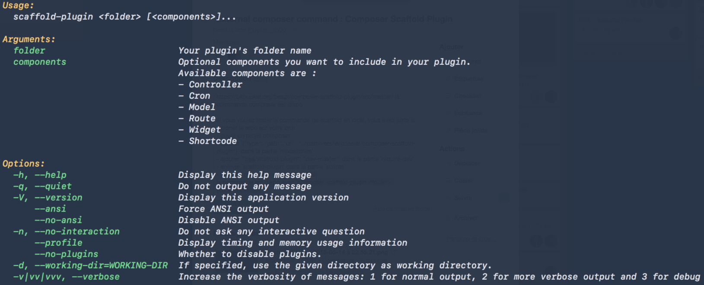

# Composer Scaffold Plugin

External composer command to scaffold a plugin with the [BEA Plugin Boilerplate](https://github.com/BeAPI/bea-plugin-boilerplate).

Increase your workflow when creating a new plugin. By launching this composer command, you will easily and quickly choose some components to add, or not, and bootstrap your new plugin.

# What ?

# How ?

## 1 - Add to [Composer](http://composer.rarst.net/)

- Add repository source : `{ "type": "vcs", "url": "https://github.com/BeAPI/composer-scaffold-plugin" }`.
- Include `"bea/composer/scaffold-plugin": "dev-master"` into your composer.json file as require dev.
- Then `composer update` before use.

## 2 - Run command 

Then you can launch `composer scaffold-plugin <folder> [<components>]` :

# Who ?

Created by [Be API](https://beapi.fr), the French WordPress leader agency since 2009. Based in Paris, we are more than 30 people and always [hiring](https://beapi.workable.com) some fun and talented guys. So we will be pleased to work with you.

This plugin is only maintained, which means we do not guarantee some free support. If you identify any errors or have an idea for improving this script, feel free to open an [issue](../../issues/new). Please provide as much info as needed in order to help us resolving / approve your request. And .. be patient :)

If you really like what we do or want to thank us for our quick work, feel free to [donate](https://www.paypal.me/BeAPI) as much as you want / can, even 1€ is a great gift for buying cofee :)

## License

Composer Freeze Version is licensed under the [GPLv3 or later](LICENSE.md).
